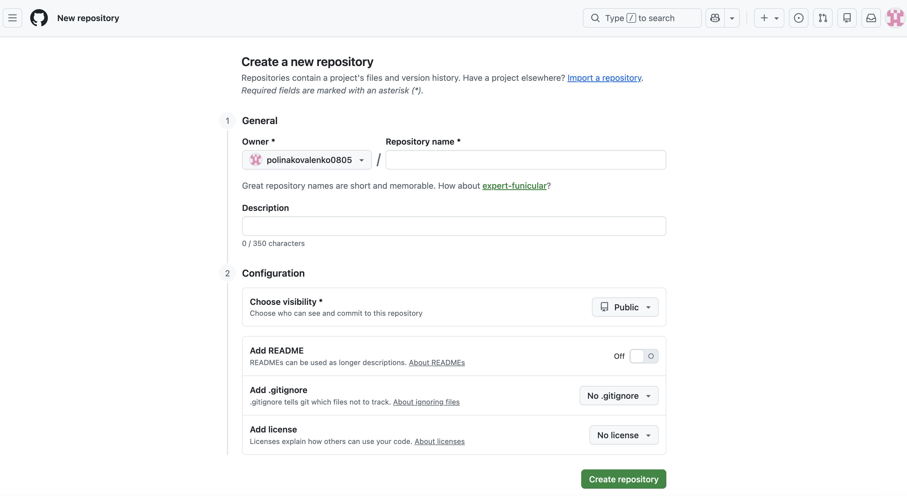
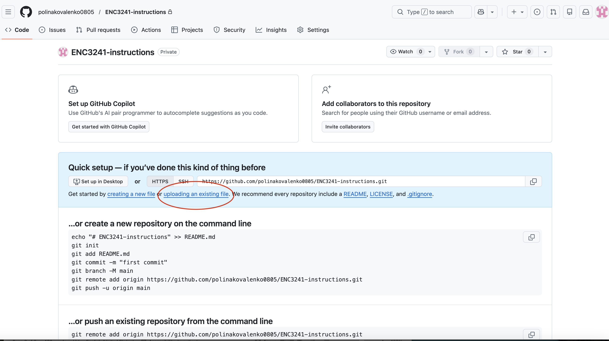
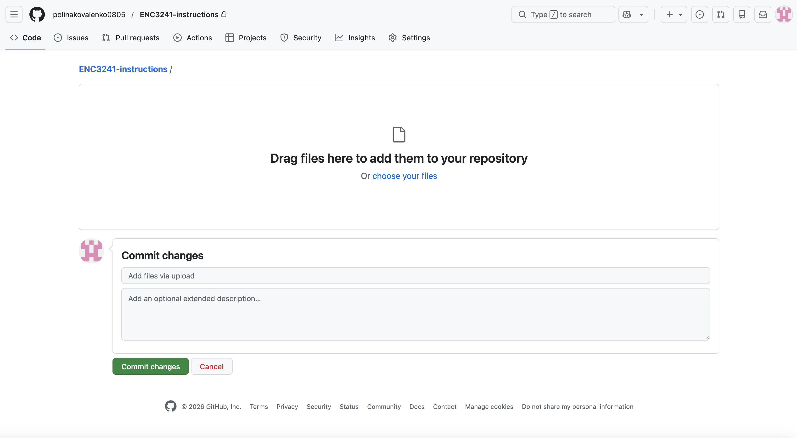

# Instructions

## How to Create a GitHub Repository and Upload a Project

### Step 1
Go to https://github.com.

---

### Step 2
Log in to your GitHub account.

---

### Step 3
Click the **New** button near the repositories section.

*Figure 1. “New” button to create a new repository on GitHub.*

---

### Step 4
Enter a clear and descriptive repository name (e.g., "portfolio-project").

*Figure 2. Creating a new repository.*

---

### Step 5
Click the **Create repository** button.

---

### Step 6
Locate the section that says:
“Get started by creating a new file or uploading an existing file.”

*Figure 3. Upload file section.*

---

### Step 7
Drag and drop your project files into the upload area.

*Figure 4. Uploading files to a repository.*

---

### Step 8
Enter a commit message (e.g., "Initial project upload").

---

### Step 9
Click **Commit changes**.

---

### Step 10
Verify your files appear in the repository.
